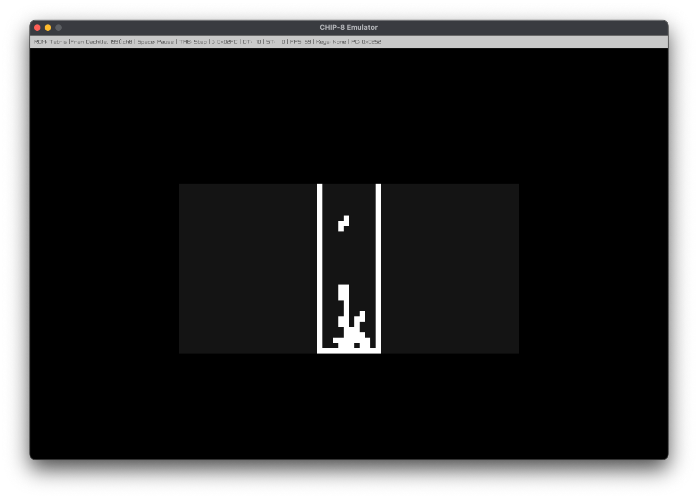
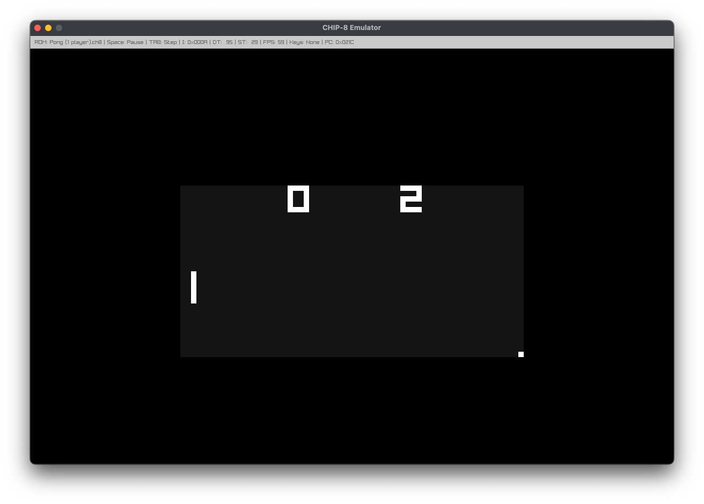
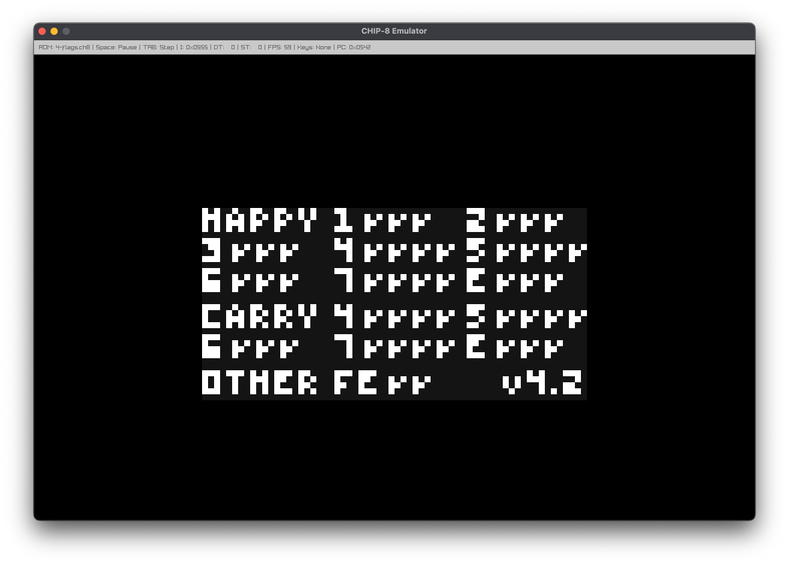

# CHIP-8 Emulator

## Requirements
- Rust
- raylib-rs:
  - glfw
  - cmake

## Quick start
```bash
# run with a ROM
cargo run -- "chip8-roms/games/Tetris [Fran Dachille, 1991].ch8"
cargo run -- "chip8-roms/games/Pong (1 player).ch8" 

# run without args to see a list of available ROMs
cargo run --
```

## Keypad mapping
```text
CHIP‑8:  1 2 3 C      Keyboard:  1 2 3 4
         4 5 6 D                 Q W E R
         7 8 9 E                 A S D F
         A 0 B F                 Z X C V
```

## Debug Controls
- **Space**: Pause/resume
- **Tab**: Toggle step mode
- **S**: Single-step (when step mode is on)

## Display
- **Status bar**: ROM name, timers (DT/ST), FPS, pressed keys, I, PC

## Notes
- **ROMs**: Included under `chip8-roms/` (games, demos, programs, tests), along with descriptions in matching `.txt` files.

## Screenshots






